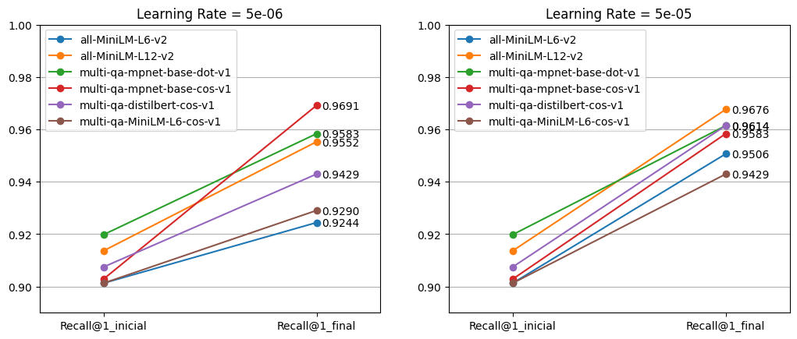
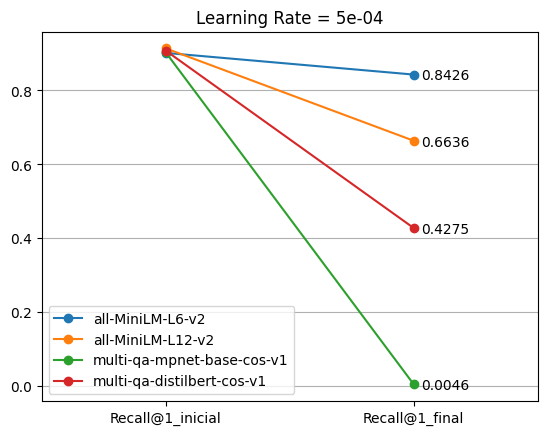

# Objetivo

A proposta deste exercício era desenvolver um sistema de _troubleshooting_ para auxiliar técnicos e engenheiros na manutenção de aeronaves, baseando-se nos dados abertos disponíveis em [Aircraft Historical Maintenance Dataset](https://www.kaggle.com/datasets/merishnasuwal/aircraft-historical-maintenance-dataset), no Kaggle.

O dataset é composto por uma série de problemas encontrados por engenheiros durante manutenções das aeronaves, e suas respectivas soluções. O objetivo final do projeto é produzir um sistema que receba descrições de problemas em aeronaves e retorne os problemas (e soluções) mais semelhantes encontrados na base.

# Desenvolvimento

O sistema desenvolvido tem como componente central uma base de dados vetorial, construída com [ChromaDB](https://www.trychroma.com/), em que são armazenadas todas as descrições de problemas do _dataset_, associadas cada uma a um índice. Ao receber uma descrição de problema enviada pelo usuário, o sistema utiliza a base de dados vetorial para fazer uma busca e encontrar os problemas mais semelhantes. Para isso, é necessária uma função de _embeddings_ de texto, que transforma cada descrição de problema em um vetor que pode ser armazenado/buscado na base. A escolha do modelo de _embeddings_ a ser utilizado foi a etapa mais trabalhosa do projeto, pois não se limitou à avaliação dos modelos disponíveis, mas contemplou também uma etapa de ajuste fino destes modelos, a fim de obter o melhor desempenho para o sistema como um todo.

Todo o processo pode ser acompanhado através dos seguintes _scripts/notebooks_:

## preproc.py

Neste _script_ de pré-processamento, o arquivo principal do _dataset_, __Aircraft_Annotation_Datafile.csv__, é lido e processado com ajuda do arquivo auxiliar __Aviation_Abbreviation_Dataset.csv__, que lista as principais abreviações utilizadas nos textos.

Após uma simples substituição das abreviações, são agrupadas as descrições de problemas que possuem exatamente o mesmo texto e estão em sequência no _dataset_.

Este _script_ produz dois arquivos: 

- __dados_tratados.csv__, em que são armazenadas as descrições de problemas e suas respectivas soluções, agrupadas através de índices para lidar com as repetições;
- __problemas.csv__, que consiste simplesmente na lista de problemas encontrados, sem repetições, associados a índices para relacionar-se posteriormente com as soluções.

## 1 - Clustering

Ao observar os dados, logo percebi que havia grandes grupos de descrições muito semelhantes entre si, quase idênticas, o que traria problemas para o método de refinar o modelo de _embeddings_, que é baseado na semelhança/dessemelhança entre sentenças. Para lidar com isso, elaborei essa etapa de clusterização dos dados, agrupando frases iguais ou quase iguais em grupos, e selecionando apenas 1 exemplo de cada grupo. Isso acabou por diminuir o tamanho do dataset, de 5.620 frases, para apenas 1.628.

Este _notebook_ utiliza o modelo de _embeddings_ __multi-qa-mpnet-base-cos-v1__ e o algoritmo __DBSCAN__ (implementação do [scikit-learn](https://scikit-learn.org/stable/modules/generated/sklearn.cluster.DBSCAN.html)) para fazer esse agrupamento. Primeiro, o modelo do [SentenceTransformers](https://sbert.net/docs/sentence_transformer/pretrained_models.html) converte todas as frases da base em vetores, e então o DBSCAN calcula as distâncias entre esses vetores, utilizando essa métrica para agrupar os mais pŕoximos.

O código produz um novo _dataset_, __problemas_dedup.csv__.

## 2 - Data Augmentation

O método escolhido para fazer o ajuste fino dos modelos de _embedding_ foi utilizando a função de custo "CosineSimilarityLoss", que calcula um valor de semelhança entre dois vetores utilizando a métrica de semelhança de cosseno, e tenta minimizar o erro entre esse valor calculado e aquele fornecido como verdade, nos dados de treinamento. Para isso, é necessário um _dataset_ composto por pares de frases e seus respectivos valores de semelhança, variando entre 0 e 1.

Optei por gerar esse conjunto de dados a partir dos dados originais, com as descrições dos problemas, da seguinte maneira: para cada frase do _dataset_, utilizei um LLM (gpt-5-mini) para gerar 4 variações, que modificassem a estrutura da frase, mas mantivessem o mesmo sentido da original. Dessa forma, consegui um conjunto de frases composto por 1.614 grupos de 5 frases semelhantes entre si. A partir desses conjuntos, pude combinar frases do mesmo grupo para gerar pares com valor de semelhança = 1, e frases de grupos diferentes com valor de semelhança = 0.

Este _notebook_ faz as chamadas para a API do LLM utilizado, fazendo apenas a geração das frases semelhantes. Para fazer essas consultas, utilizei um pouco de _prompt engineering_, fornecendo ao modelo alguns exemplos das variações pedidas e também algumas regras e restrições. Foram necessárias algumas tentativas e experimentação para chegar a um _prompt_ que produzisse os efeitos desejados.

O novo _dataset_ com as frases adicionais é salvo no arquivo __dataset_aumentado.csv__.

## 3 - Divisão do Dataset

Neste _notebook_ é feita a divisão do _dataset_ em conjuntos de treino, teste e validação, utilizando a proporção 80/10/10. A divisão é feita com base nos grupos de frases, de forma a não separar suas frases entre os diferentes conjuntos. Dessa forma, cada um dos três conjuntos é composto por 20% de frases originais, e 80% de variações artificiais correspondentes.

Também é feito um tratamento simples dos dados, para limpar algumas linhas e espaços em branco introduzidas pelo processo anterior de aumentação, e normalizar toda capitalização do texto em caixa alta.

Os conjuntos de dados são salvos nos arquivos __dataset_treino.csv__, __dataset_validacao.csv__ e __dataset_teste.csv__.

## 4 -  Benchmark

Para selecionar os modelos mais adequados para o ajuste fino, e também obter uma linha de base de performance, foi avaliado o desempenho de 10 modelos originais do Sentence Transformers. Para isso, utilizou-se uma métrica de _recall at K_ (estilizado _recall@k_), tomando como _corpus_ de frases as 162 frases originais do conjunto de teste, e como _queries_ de busca as outras 648 variações correspondentes. Dessa forma, para cada uma das 648 variações, havia apenas uma frase correta a ser buscada no _corpus_, dentre 162. Foram calculadas as métricas de _recall@1_, _recall@3_ e _recall@7_, representando o número de frases corretas encontradas quando selecionadas as 7, 3 e 1 frases mais semelhantes à _query_ no _corpus_, de acordo com a função de _embedding_.

Os resultados obtidos estão armazenados em __benchmark_inicial_corrigido.csv__, mas também podem ser visualizados a seguir:

|Modelo		|Recall@1	|Recall@3	|Recall@7|
|----|----|----|----|
|all-mpnet-base-v2		|0.8657407407	|0.9552469136	|0.9830246914|
|all-distilroberta-v1		|0.825617284	|0.9058641975	|0.9429012346|
|all-MiniLM-L6-v2		|0.9012345679	|0.9675925926	|0.9861111111|
|all-MiniLM-L12-v2		|0.9135802469	|0.9768518519	|0.9938271605|
|multi-qa-mpnet-base-dot-v1		|0.9197530864	|0.962962963	|0.9845679012|
|multi-qa-distilbert-dot-v1		|0.8904320988	|0.9660493827	|0.9922839506|
|multi-qa-MiniLM-L6-dot-v1		|0.8919753086	|0.9614197531	|0.9845679012|
|multi-qa-mpnet-base-cos-v1		|0.9027777778	|0.9614197531	|0.9861111111|
|multi-qa-distilbert-cos-v1		|0.9074074074	|0.9645061728	|0.9938271605|
|multi-qa-MiniLM-L6-cos-v1		|0.9012345679	|0.9598765432	|0.987654321|

Os 4 primeiros modelos são modelos genéricos de _embeddings_ de frases, enquanto os outros 6 foram especializados em busca semântica. Além disso, os modelos especializados foram otimizados para trabalharem com uma métrica específica de semelhança entre vetores (produto interno ou semelhança de cosseno), enquanto os genéricos não especificam uma métrica. Para avaliar a semelhança entre os vetores, utilizou-se o próprio método 'similarity' de cada modelo.

Os modelos __all-distilroberta-v1__ e __all-mpnet-base-v2__ tiveram resultados mais baixos, em relação aos outros modelos, mas os modelos __all-MiniLM__, apesar de não serem especializados em busca semântica (e serem modelos mais leves), obtiveram resultados equiparáveis com aqueles dos modelos especializados. No geral, todos os modelos obtiveram ótimos resultados para a tarefa.

Ao final do _benchmark_, os 6 melhores modelos foram selecionados para serem refinados, sendo o resultado do modelo __all-MiniLM-L12-v2__ tomado como linha de base, por ser ligeiramente superior.

## 5 - Preparando Datasets

Este _notebook_ faz as transformações necessárias nos conjuntos de treino e validação, para que os dados estejam no formato esperado para a função de custo, ou seja, pares de frases acompanhados de um valor de semelhança. Conforme explicado anteriormente, são selecionados pares de frases do mesmo grupo, com o mesmo significado, para terem o valor 1, e pares de frases de grupos diferentes para terem o valor 0. Buscou-se elaborar conjuntos de dados com 50% de exemplos de valor 1 e 50% de valor 0, equilibrando frases de todos os grupos, sem favorecer nenhum.

Os _datasets_ formatados foram salvos em __dataset_treino_pronto.csv__ e __dataset_validacao_pronto.csv__.

## 6 - Refinamento

Para realizar o refinamento dos modelos, foi utilizado o próprio _framework_ de treinamento da biblioteca Sentence Transformers, utilizando a função de custo CosineSimilarityLoss e os conjuntos de treino e validação já preparados. Para melhor acompanhar a evolução dos modelos, foi elaborado um objeto Evaluator que calcula as métricas de _recall@1_, _recall@3_ e _recall@7_, a cada período de validação, utilizando para isso os dados brutos de validação (_corpus_ e _queries_, sem associação de pares).

Num primeiro momento, foram treinados os 6 melhores modelos, cada um com dois _learning rates_ diferentes, de 5e-06 e 5e-05, por 4 épocas cada um. Ao final do treinamento, o modelo salvo tem os pesos do momento em que obteve a melhor performance quanto à métrica de _recall@1_, mesmo que isso tenha acontecido no início do treinamento.

As métricas e estatísticas dos treinamentos foram logadas utilizando __WandB__, e podem ser conferidas [aqui](https://wandb.ai/ana-sovat-/conserta-avioes_fine-tuning_01)

No geral, os modelos apresentaram resultados melhores com o _learning rate_ maior, de 5e-05, o que me levou a fazer mais uma rodada de treinamento, com um _learning rate_ ainda maior, de 5e-04, apenas com os 4 melhores modelos. Os resultados, no entanto, mostram que esse com certeza é um valor muito alto para esses modelos e dados, mostrando um claro _over-fitting_ dos dados.

Ao final do treinamento, cada modelo foi testado com o mesmo conjunto de testes utilizado no _benchmark_, com as mesmas métricas de _recall@k_. Os resultados foram salvos em __resultados_finetuning.csv__, mas também podem ser conferidos a seguir:

|Modelo Base	|Learning Rate	|Recall@1	|Recall@3	|Recall@7|
|----|----|----|----|----|
|all-MiniLM-L6-v2	|5.00E-06	|0.924382716	|0.9768518519	|0.9969135802|
|all-MiniLM-L12-v2	|5.00E-06	|0.9552469136	|0.9938271605	|1|
|multi-qa-mpnet-base-dot-v1	|5.00E-06	|0.9583333333	|0.9938271605	|1|
|multi-qa-mpnet-base-cos-v1	|5.00E-06	|0.9691358025	|0.9969135802	|1|
|multi-qa-distilbert-cos-v1	|5.00E-06	|0.9429012346	|0.9891975309	|0.9969135802|
|multi-qa-MiniLM-L6-cos-v1	|5.00E-06	|0.9290123457	|0.9830246914	|0.9938271605|
|all-MiniLM-L6-v2	|5.00E-05	|0.950617284	|0.9830246914	|0.9984567901|
|all-MiniLM-L12-v2	|5.00E-05	|0.9675925926	|0.9953703704	|1|
|multi-qa-mpnet-base-dot-v1	|5.00E-05	|0.9614197531	|0.9891975309	|0.9984567901|
|multi-qa-mpnet-base-cos-v1	|5.00E-05	|0.9583333333	|0.9953703704	|0.9984567901|
|multi-qa-distilbert-cos-v1	|5.00E-05	|0.9614197531	|0.9891975309	|0.9984567901|
|multi-qa-MiniLM-L6-cos-v1	|5.00E-05	|0.9429012346	|0.9861111111	|0.9969135802|
|all-MiniLM-L6-v2	|0.0005	|0.8425925926	|0.9367283951	|0.9861111111|
|all-MiniLM-L12-v2	|0.0005	|0.6635802469	|0.7978395062	|0.8734567901|
|multi-qa-mpnet-base-cos-v1	|0.0005	|0.00462962963	|0.006172839506	|0.0262345679|
|multi-qa-distilbert-cos-v1	|0.0005	|0.4274691358	|0.5864197531	|0.7037037037|

## 7 - Gráfico

_Notebook_ simples para elaboração do gráfico comparando os resultados de _recall@1_ para cada modelo base e _learning rate_.

Os gráficos podem ser conferidos a seguir:

